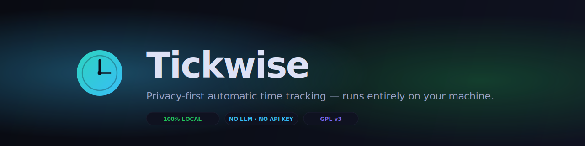

<div align="center">



<br />

[](LICENSE)
[](https://github.com/code-lodge/tickwise/releases/latest)
[](https://github.com/code-lodge/tickwise/actions)
[](https://github.com/code-lodge/tickwise/releases/latest)
[](#why-tickwise)

**Privacy-first automatic time tracking for freelancers — runs entirely on your machine. No cloud, no API keys, no subscription. Classifies your work by matching project keywords against window titles, browser URLs, and on-screen text.**

[Website](https://tickwise.app) · [Download](https://github.com/code-lodge/tickwise/releases/latest) · [Browser extension](#-browser-extension) · [Configuration](#%EF%B8%8F-configuration) · [Contributing](#-contributing)

</div>

---

## Why Tickwise

Manual time tracking is broken. You forget to start the timer, you forget to stop it, you forget which project you were on, and at the end of the month you guess at hours and eat unbilled time.

Most "automatic" alternatives fix that by uploading your screen to a cloud service or sending your activity to an LLM. That's a non-starter for anyone working under NDA, on client systems, or simply allergic to handing every keystroke of context to a third party.

Tickwise stays on your laptop. It watches the active window, asks the browser extension for the exact tab URL, runs OCR on the screen if you want richer signal, and decides which project the activity belongs to by **matching the project's keywords against that combined text**. No network, no inference, no cost — just a fast deterministic match. The dashboard, the database, the classifier, and the matching logic all live inside a single ~80 MB binary that you double-click.

## Features

- 🎯 **Fuzzy keyword classifier** — `"Sceneryenzo"` matches `"scenery en zo"`, `"Scenery-Enzo"`, `"sceneryenzo.com"` and `"SCENERY ENZO"`. Spacing, punctuation and case are ignored. Multi-word keywords also win on partial matches.
- 🖥️ **Tray-resident** — clock-face system tray icon shows tracking / paused / focus / break states. Right-click for Open Dashboard, Pause, Start Pomodoro, Quit.
- 🔍 **Change-detection capture** — perceptual-hash diff means OCR runs only when the screen actually changes (~2-4 times/min, not 60).
- 🖥️ **Multi-monitor** — captures every screen, classifies the focused one, hash-tracks the rest for instant classification on focus switch.
- 💤 **Idle detection** — auto-pauses after a configurable idle threshold, resumes when input returns.
- 🌐 **Browser extension** — Chrome MV3 + Firefox bridge that pushes the *exact* tab URL and title to the local API over WebSocket. Domain blocklist for banking, personal email, etc.
- 🍅 **Pomodoro** — built-in focus/break state machine. Tags every captured session with the active period. Controls from tray menu, dashboard, browser popup and mobile.
- 📅 **Calendar sync** — ICS feed (Tuta, Google, Apple), CalDAV (Radicale, Nextcloud), Google Calendar OAuth2.
- 🧾 **Invoicing** — line-item-grouped PDFs from tracked time, configurable HTML/CSS template, Dutch BTW/KVK/IBAN out of the box.
- 📊 **Dashboard** — live view, timeline (day/week/month), reports, project & client management, dark mode, keyboard shortcuts (Ctrl+P / Ctrl+,).
- 📱 **Mobile PWA** — view today, start/stop Pomodoro, see the timeline from your phone. QR-code pairing, optional Cloudflare Tunnel for off-LAN access.
- 🔒 **4-level redaction** — strips secrets / PII / names / structure before *any* text is written to disk.
- 🔐 **Local-only API** — FastAPI bound to `127.0.0.1:19532`. Nothing leaves the machine unless you opt-in to Cloudflare Tunnel for the calendar feed or mobile pairing.

## Quick Start

### Download

| Platform | Installer | Notes |
| -------- | --------- | ----- |
| Windows x64 | [Download Tickwise-Setup.exe →](https://github.com/code-lodge/tickwise/releases/latest) | Windows 10 / 11. Tray app + bundled dashboard |
| macOS | _coming soon_ | Apple Silicon + Intel |
| Linux | _coming soon_ | AppImage |

> **First-launch:** the binaries are not yet code-signed. Windows SmartScreen will warn — click *More info → Run anyway*.

Double-click to launch. The tray icon appears, the dashboard opens at <http://127.0.0.1:19532/>, and a fresh SQLite database is created at `%APPDATA%\Tickwise\tickwise.db` on first run.

### Build from source

You will need Python 3.12+ and Node.js 20+.

```powershell
git clone https://github.com/code-lodge/tickwise
cd tickwise

python -m venv .venv
.\.venv\Scripts\pip install -e .

# Build the dashboard once (Angular)
Push-Location dashboard ; npm install ; .\node_modules\.bin\ng build ; Pop-Location
Copy-Item dashboard\dist\tickwise-dashboard\browser\* tickwise\static -Recurse -Force

# Run the tray app
.\.venv\Scripts\pythonw.exe -m tickwise
```

Dev workflow: run `python -m tickwise` for the backend, then `cd dashboard && ng serve --proxy-config proxy.conf.json` for hot-reload at <http://localhost:4200>.

### Build the .exe

```powershell
.\.venv\Scripts\pip install pyinstaller
.\.venv\Scripts\python.exe -m PyInstaller packaging\tickwise.spec --clean --noconfirm
# → dist\Tickwise\Tickwise.exe
```

---

## How classification works

Tickwise has a single classifier — a deterministic keyword matcher that runs in two stages:

**Stage 1 — Normalized substring match.** Both the keyword and the haystack (window title + browser URL + tab title + OCR text) get lowercased and stripped of every non-alphanumeric character. So `"Scenery-Enzo Website!"` and `"scenery en zo"` both become `"sceneryenzo"`-prefixed strings, and a substring check finds them.

**Stage 2 — Token-set fallback.** If the whole-keyword pass misses, the keyword is split into significant words (stop-words like `website`, `app`, `dashboard`, `the`, `and` are dropped). At least one token must appear in the normalized haystack. This is what makes a project named *"Sceneryenzo website"* still claim a tab whose only signal is `sceneryenzo`.

When several projects could match, the project with the **highest score** wins (score = total characters of matched text, with a 2× bonus for whole-keyword matches). Ties are broken by project id (oldest wins, stable).

You manage keywords directly on the **Projects** page — one keyword per line. New projects auto-populate with the project's name; you can add as many aliases as you want:

```
Sceneryenzo
scenery enzo
sceneryenzo.com
scenery-enzo
SE-website
```

If nothing matches, the activity is stored as `unclassified`. You can reassign it manually from the timeline at any time.

---

## 🌐 Browser extension

Window titles in modern browsers are useless for time tracking — Edge will happily report "Tickwise and 5 more pages — Work — Microsoft Edge" while you're on `sceneryenzo.com`. The browser extension fixes that by pushing the *real* active-tab URL and title to the local Tickwise API over WebSocket.

### Install

**Chrome / Edge / Brave / Arc**

1. Open `chrome://extensions/` (or `edge://extensions/`)
2. Enable **Developer mode** (toggle, top-right)
3. **Load unpacked** → select the `browser-extension/` folder

**Firefox**

1. Open `about:debugging` → *This Firefox*
2. **Load Temporary Add-on** → select `browser-extension/manifest.firefox.json`

The extension talks only to `127.0.0.1:19532` — nothing leaves the browser. A configurable domain blocklist (default: `mail.google.com`, `online.banking`) excludes sensitive sites entirely.

---

## ⚙️ Configuration

Most settings live in the dashboard (**Settings** page) and are stored in the local SQLite database. Capture interval, idle thresholds, OCR downscaling, redaction levels, Pomodoro durations, dark mode — all editable in the UI, no config file to hand-edit.

| Setting | Default | What it does |
| ------- | ------- | ------------ |
| `capture_interval_ms` | 1000 | How often the capture loop ticks |
| `phash_change_threshold` | 5 | Hamming-distance threshold for OCR re-run |
| `idle_merge_threshold` | 120 s | Idle gap that gets merged into the active session |
| `idle_split_threshold` | 300 s | Idle gap that splits the session into two |
| `min_session_duration` | 10 s | Sessions shorter than this are discarded |
| `privacy_level` | 2 | 1 = secrets only, 2 = + PII, 3 = + names, 4 = strip structure |
| `pomodoro_work_minutes` | 25 | Focus duration |
| `pomodoro_short_break_minutes` | 5 | Short break duration |
| `pomodoro_long_break_minutes` | 15 | Long break duration |
| `pomodoro_cycles_before_long` | 4 | Focus cycles before a long break |
| `dark_mode` | false | Dashboard theme |

### Privacy levels

| Level | Strips |
| ----- | ------ |
| **1 — Minimal** | API keys, passwords, private keys, JWTs, connection strings |
| **2 — Standard** _(default)_ | + Emails, phone numbers, IPs, IBANs, credit cards, file paths |
| **3 — Aggressive** | + Person/organisation names, monetary amounts, chat content, shell commands |
| **4 — Maximum** | + Code blocks, all URLs, tabular data, quoted text |

Custom redaction patterns let you blacklist client-specific terms (project codenames, internal domains, etc.). The dashboard has a live preview that shows what each level does to a sample of your text.

---

## Architecture

```
┌─────────────────────────────────────────────────────────────────────────┐
│  SYSTEM TRAY   (pystray)   — clock icon, status text, context menu      │
└──────────────────────────────────┬──────────────────────────────────────┘
                                   │
                                   ▼
┌─────────────────────────────────────────────────────────────────────────┐
│  BACKGROUND SERVICE                                                      │
│                                                                          │
│  Capture loop  →  pHash diff  →  OCR (PaddleOCR)  →  Redaction          │
│  (1 s tick)       (skip cost)    (CPU only)          (4 levels)         │
│                                                                          │
│             →  Keyword matcher  →  Session tracker                      │
│                (deterministic)     (open / extend / close)              │
│                                                                          │
│  Pomodoro state machine  ·  Idle detector  ·  Browser-bridge WebSocket  │
└──────────────────────────────────┬──────────────────────────────────────┘
                                   │ writes
                                   ▼
┌─────────────────────────────────────────────────────────────────────────┐
│  SQLite (WAL)  ·  %APPDATA%\Tickwise\tickwise.db                        │
└──────────────────────────────────┬──────────────────────────────────────┘
                                   │ reads
                                   ▼
┌─────────────────────────────────────────────────────────────────────────┐
│  FastAPI  on  127.0.0.1:19532                                           │
└──────────┬──────────────────────────────────┬───────────────────────────┘
           ▼                                  ▼
   Dashboard (Angular 19)         Browser extension (Chrome MV3 / Firefox)
   Mobile PWA (via Cloudflare Tunnel, optional)
```

Single process. Multiple threads. No containers, no cloud, no accounts. Just a desktop app that double-clicks.

```
tickwise/
├── tickwise/
│   ├── capture/             # Screen capture, window info, idle, change detection
│   ├── ocr/                 # PaddleOCR wrapper, lazy-loaded
│   ├── redaction/           # 4-level privacy redaction engine
│   ├── classification/
│   │   ├── keyword_matcher.py  # Fuzzy normalized + token-set matching
│   │   └── pipeline.py         # redact → match → store
│   ├── sessions/            # Open / extend / close session aggregation
│   ├── pomodoro/            # Focus/break state machine
│   ├── calendar/            # CalDAV, ICS feed, Google Calendar
│   ├── cloudflare/          # Optional Tunnel setup (mobile + ICS only)
│   ├── invoices/            # PDF generation via WeasyPrint
│   ├── reports/             # Time / billing / activity aggregation
│   ├── api/                 # FastAPI routers, WebSocket, bearer auth
│   ├── db/                  # SQLite connection, schema, migrations
│   ├── crypto/              # OS keyring (Windows DPAPI / Keychain / Secret Service)
│   └── platform/            # Cross-platform autostart, notifications, paths
├── dashboard/               # Angular 19 standalone components + signals
├── browser-extension/       # Chrome MV3 + Firefox WebExtensions
├── mobile/                  # Angular PWA companion app
├── packaging/               # PyInstaller spec, NSIS installer, build scripts
├── docs/                    # Specification, GitHub Pages site
└── tests/                   # pytest: unit, integration
```

---

## Feature status

| Feature | Status | Platform |
| ------- | ------ | -------- |
| Tray icon + dashboard + capture loop | ✅ Done | Windows |
| Fuzzy keyword classifier (normalized + token-set) | ✅ Done | All |
| pHash change detection | ✅ Done | All |
| Multi-monitor capture | ✅ Done | All |
| Idle detection | ✅ Done | All |
| Pomodoro state machine | ✅ Done | All |
| 4-level redaction engine + custom rules | ✅ Done | All |
| Invoicing (PDF + line-items + Dutch BTW) | ✅ Done | All |
| Calendar sync (ICS feed + CalDAV + Google) | ✅ Done | All |
| Cloudflare Tunnel for mobile + ICS | ✅ Done | All |
| Mobile PWA + bearer auth + QR pairing | ✅ Done | All |
| Browser extension (Chrome MV3 + Firefox) | ✅ Done | All |
| OCR (PaddleOCR, CPU) | 🚧 Optional install | All |
| macOS build | 📋 Planned | macOS |
| Linux AppImage build | 📋 Planned | Linux |
| Code signing | 📋 Planned | All |

---

## Performance

| Metric | Target | Why it matters |
| ------ | ------ | -------------- |
| CPU (idle screen) | < 1 % | Tickwise should be invisible on a quiet day |
| CPU (active use) | < 5 % | OCR is the only spike — rate-limited by the pHash diff |
| RAM | < 200 MB | Including bundled dashboard + Python runtime |
| VRAM | 0 | Everything is CPU. No GPU dependency, no driver headaches |
| DB growth | ~5–10 MB / month | WAL-mode SQLite, no screenshots stored |
| Classification calls | 0 / month | Local matcher, no network |
| Cost | **$0 / month** | The only paid component is the (optional) Cloudflare account for the tunnel |

---

## Privacy & security

- **All data stays local.** SQLite database on your machine. No cloud sync, no accounts, no telemetry.
- **No keylogging.** Input events are counted for idle detection only — keystrokes are never recorded.
- **Screenshots are never stored.** Captured in memory, OCR'd, then discarded.
- **Redaction before persistence.** OCR text is stripped of secrets / PII before it touches the database.
- **API server is local-only.** FastAPI binds to `127.0.0.1` — nothing is accessible from the network.
- **Tunnel is scoped.** When enabled, Cloudflare Tunnel exposes only the calendar feed and mobile API. The dashboard is never exposed.
- **Credentials in OS keyring.** Mobile bearer-token hashes go in SQLite; anything secret (Cloudflare token, Google OAuth refresh token) goes through Windows DPAPI / macOS Keychain / Linux Secret Service.

---

## Contributing

Contributions of any kind are welcome — bug reports, redaction rules, new calendar providers, platform builds, dashboard polish. To get started:

1. Fork the repository and create a feature branch.
2. Run the tests with `pytest`. Format with `black`, lint with `ruff`, type-check with `mypy`.
3. New features should ship with tests. Bug fixes should ship with the regression test that would have caught them.
4. Open a pull request describing what you changed and why.

Tickwise is licensed under the **GNU General Public License v3.0**. See [`LICENSE`](LICENSE) for the full text.

---

<div align="center">


<br />
<br />

Made with care by [Hylke Hellinga](https://github.com/hylkehellinga)

</div>
